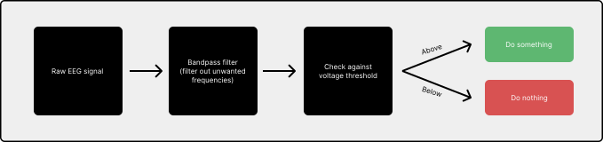
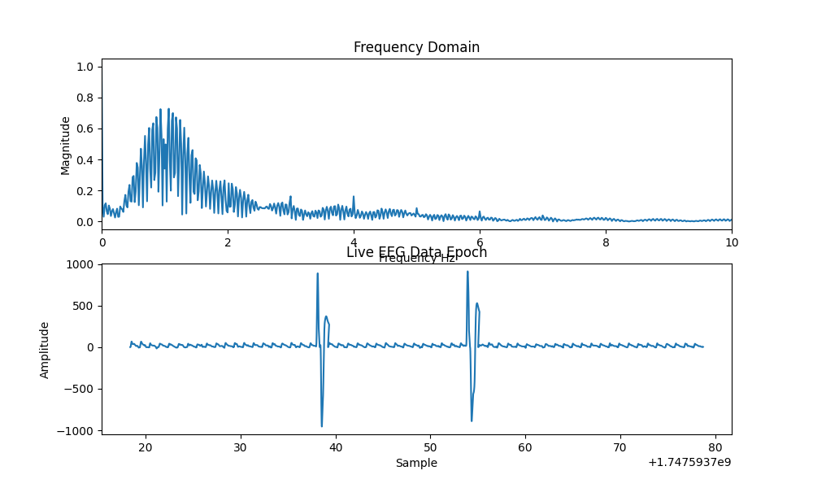
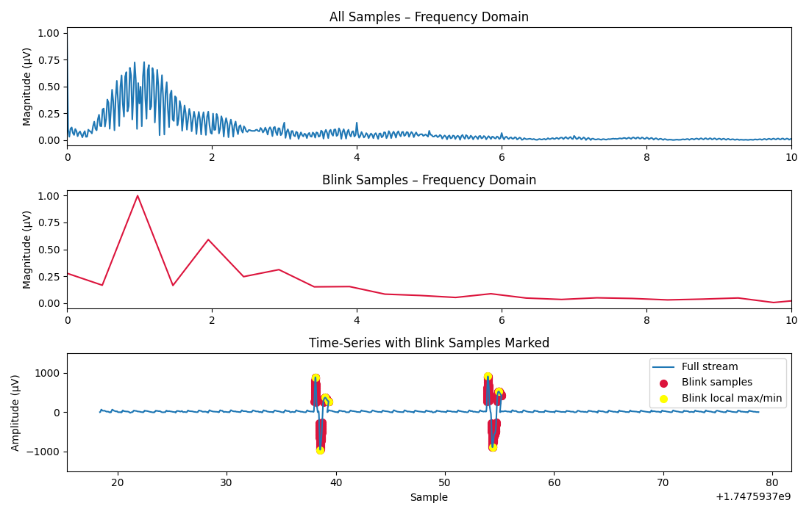

# synapse-slides
This repository contains a companion Python script to use with a Muse EEG device that measures neural signals in real time and performs shortcut actions upon detection of certain actions, such as blinking. In the current state of the project, it allows for the advancement of a slideshow or fast-forwarding a video (right arrow key shortcut) when an intentional blink is detected. Read more below to learn more about the system and its' usage!

### System overview
</img>

### Running the program
1. The prerequisite for this program is that you must have already connected your Muse EEG device to the computer you will be using to run the script
2. Clone this repository on your device, either using the command below in the terminal, or by downloading as a ZIP
   ```
   git clone https://galaxygoldfish/synapse-slides
   ```
3. Navigate to the folder containing the project files, and run the script using the following command
   ```
   python app.py
   ```
4. If you are intending to use this to advance a slideshow, the presentation app must be in focus

### Specifics during runtime
Currently, our script is not designed to run indefinitely. To customize how long to listen for EEG signals, open ```app.py``` and edit the ```RUNTIME_SECONDS``` variable (on line 45) to change how long (in seconds) the program will run
```python
# Record for 60 seconds / 1 minute
RUNTIME_SECONDS = 60
```

### Calibrating thresholds to improve accuracy
One limitation of the current state of this program is that it does not use adaptive learning models, so it is not likely to be as accurate when individuals use it without calibrating it. Here, we discuss the methods that are used by the program to detect a blink and how they can be edited for higher accuracy.

#### Method for detecting a blink
Before we explain which parameters in the code to edit, first we will explain how a blink is detected. Below is an overview of how signals are received and how we know if a blink is happening or not.<br></br>
</img><br></br>
Therefore, the parameters that we want to change in order to improve the blink detection accuracy from person to person are
1. The frequency range used in the bandpass filter
2. The voltage threshold

#### Visual data produced
You may notice that after running the program, when it exits, a few graph files are produced. These provide information about when the program thinks that a blink occurred.
1. ```time_freq_<time>.png``` will be a graph that looks something like this, where the top plot is a plot of the EEG signal in frequency domain, and the bottom plot is the raw signal in time domain
   </img>
2. ```blink_vs_all_<time>.png``` will be a graph similar to the one above, but with blink times highlighted in red. The top is the EEG signal in frequency domain, middle is essentially a subset of the EEG signal where blinking is thought to occur in frequency domain, and the bottom graph is the EEG data in time domain with waves that surpass the threshold highloghted in red (assumed to be during blink times)
   </img>

#### How to find your frequency range & voltage threshold
We reccommend running multiple trials where intentional blinking occurrs and then visually inspecting the graphs produced to inform what to change your parameters to. In our case, we had the duration set to 60 seconds, and instructed the subject to blink (intentionally) once every 15 seconds. This way, the peaks will be separated enough in the data and easier to pick out, however you are free to modify the experimental setup to whatever works best in your case.


The first thing that you will want to do if you are not getting good accuracy, is to edit the blink voltage threshold. If an EEG signal is found to be in between the ```BLINK_MIN_THRESHOLD``` and ```BLINK_MAX_THRESHOLD```, then it will be highlighted in red on the bottom plot of the ```blink_vs_all_<time>``` figure produced. Try a few runs where you edit these constants, and see if the red highlighting becomes more accurate.

The other constants you will want to change will be the ```low``` and ```high``` parameters in the ```bandpass``` function. These represent the frequency of brain waves we select out of the raw EEG data that we receive (all other frequencies will not be included in the analysis). So, this means that only IF a received EEG wave is WITHIN the ```low``` and ```high``` FREQUENCY and it is ALSO BETWEEN the ```BLINK_MIN_THRESHOLD``` and ```BLINK_MAX_THRESHOLD``` voltage, then we classify it as a blink.
